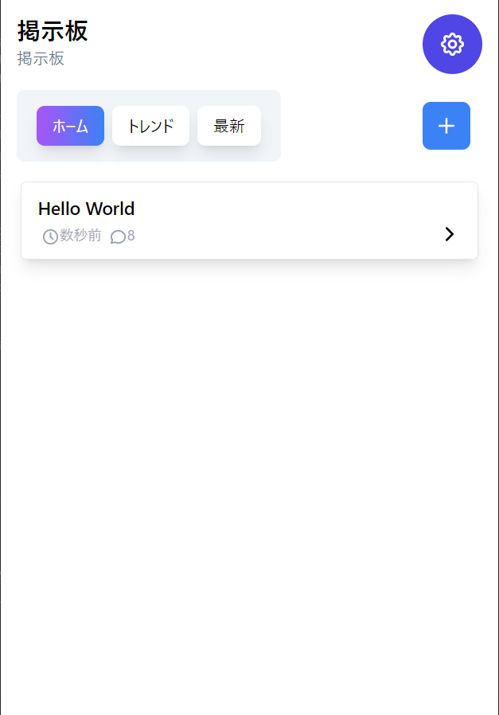
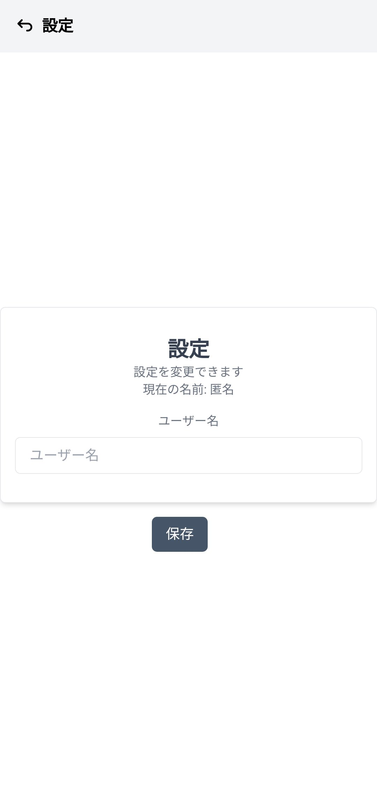
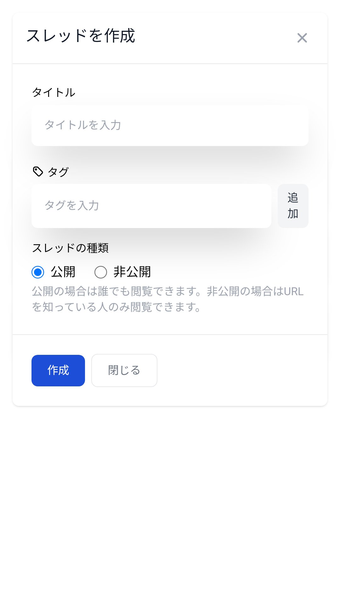

# Next Boards

このリポジトリは、Next.js、Tailwind CSS、MongoDB、NextAuth.jsを使った掲示板です。
LINEでログインすることができ、ユーザー登録、ログイン、名前の変更ができます。
スレッドを作成することができ、タグ付け、パブリックスレッド、プライベートスレッドがあります。

## 機能

- ユーザー登録 ([LINEログイン](https://next-auth.js.org/providers/line))
- ログイン
- 名前の変更
- データベース ([MongoDB](https://cloud.mongodb.com))
  - スレッド作成
    - タグ付け
    - パブリックスレッド
    - プライベートスレッド
  - スレッド一覧
  - レス送信

## デモ

| ホーム画面 | 設定画面 |
| -------- | ------- |
|  |  |

| スレッド作成画面 | スレッド |
| ------------- | ------- |
|  |  |

## 使い方

### Dev server

```bash
git clone https://github.com/HRTK92/next-boards.git
cd next-boards
yarn dev
```

開発サーバーが起動します。

### Build

```bash
yarn build
```

### Start

```bash
yarn start
```

## .envの設定

```bash
# .env
DATABASE_URL={DATABASE_URL}
SECRET={NEXTAUTH_SECRET}

LINE_CLIENT_ID=
LINE_CLIENT_SECRET=

NEXTAUTH_URL=

NEXT_PUBLIC_SITE_NAME= // サイト名
```
